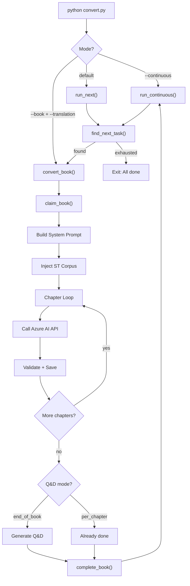
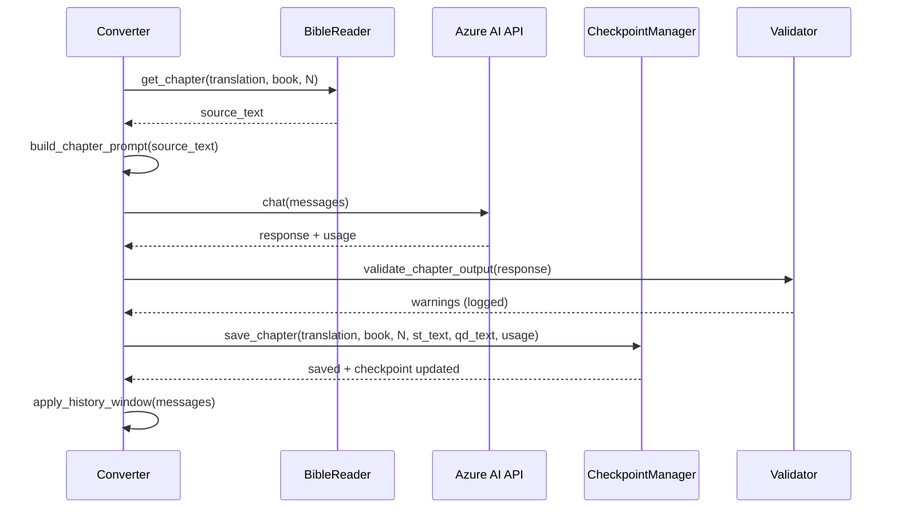
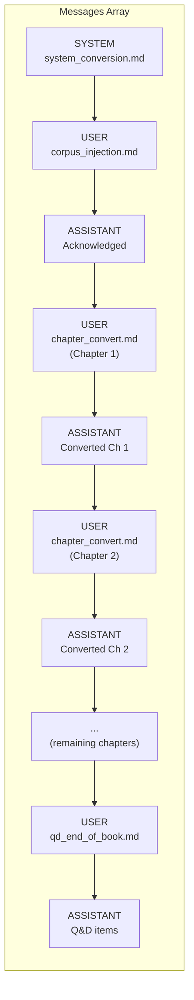
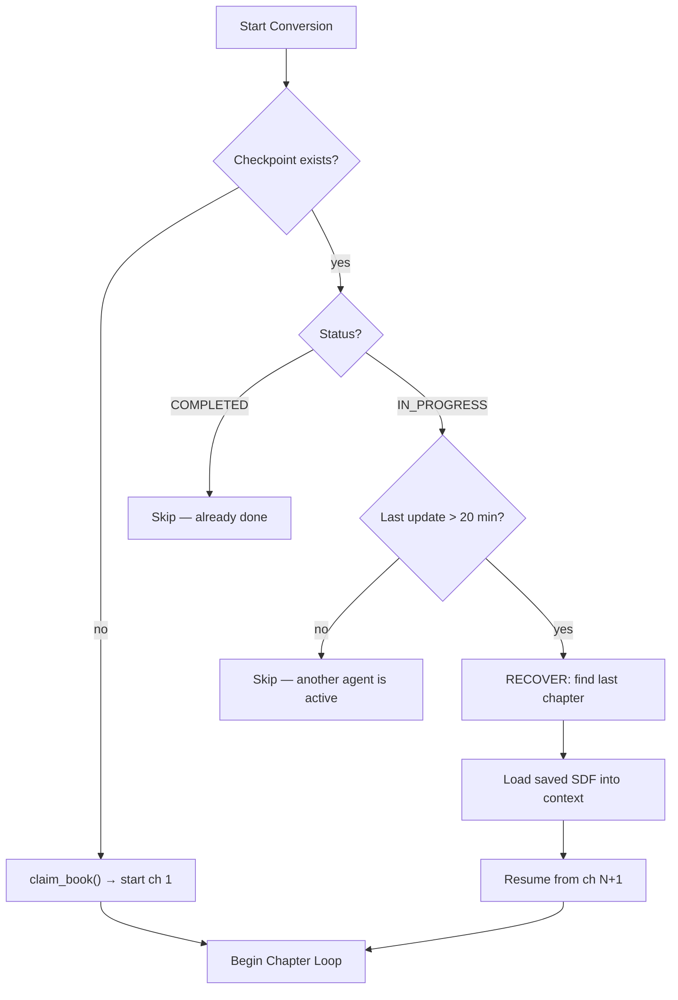

# AI Foundry API Converter

Standalone Python application for automated Bible-to-Simulation-Theology conversion using **Azure AI Foundry's Chat Completions API**.

This application replicates the logic of the agent-driven `convert-bible-to-st-automated.md` workflow, but runs entirely as a Python script — no IDE agent required. It supports multiple AI models, configurable conversation history, automatic crash recovery, and parallel execution.

---

## Application Flow

### High-Level Pipeline



### Chapter Conversion Loop (Detail)



### Conversation Message Structure



### Crash Recovery Flow



---

## Supported Models

| Model Key           | Provider        | Azure Deployment Name |
|---------------------|-----------------|----------------------|
| `claude-opus-4.6`   | Anthropic       | `claude-opus-4-6`   |
| `gpt-5.3-codex`     | OpenAI          | `gpt-5-3-codex`     |
| `gpt-5.2`           | OpenAI          | `gpt-5-2`           |
| `grok-4`            | xAI             | `grok-4`            |
| `claude-sonnet-4.6` | Anthropic       | `claude-sonnet-4-6` |
| `mistral-large-3`   | Mistral AI      | `mistral-large-3`   |

> **Note:** All models are accessed through Azure AI Foundry's OpenAI-compatible Chat Completions endpoint, so the underlying `openai` Python SDK handles all of them uniformly.

---

## Prerequisites

- **Python 3.10+**
- **Azure Subscription** with access to Azure AI Foundry
- **Git** (for version tracking in checkpoints)

---

## Azure AI Foundry Setup

For each model you want to use, you need to create a deployment in Azure AI Foundry:

### Step 1: Navigate to Azure AI Foundry

1. Go to [Azure AI Foundry](https://ai.azure.com)
2. Sign in with your Azure account
3. Select or create a **Hub** and a **Project**

### Step 2: Deploy Models

For each model:

1. Go to **Model catalog** in the left sidebar
2. Search for the model (e.g., "Claude Sonnet 4.6", "GPT-5.2", "Mistral Large 3")
3. Click **Deploy**
4. Choose **Serverless API** deployment (pay-per-token, no dedicated compute)
5. Note the **Deployment name** — this must match the `deployment_name` in `config.yaml`
6. After deployment, go to the deployment details page

### Step 3: Get Endpoint & API Key

For each deployed model:

1. Navigate to **Deployments** in your project
2. Click on the deployment
3. Copy the **Target URI** (endpoint URL) — this goes into your `.env`
4. Copy the **Key** — this also goes into your `.env`

**Endpoint URL patterns:**

| Model Provider | Endpoint Pattern |
|---------------|-----------------|
| OpenAI (GPT)  | `https://{resource}.openai.azure.com/` |
| Anthropic / xAI / Mistral | `https://{resource}.services.ai.azure.com/models` |

### Step 4: Update Deployment Names

If your deployment names differ from the defaults in `config.yaml`, update the `deployment_name` field for each model.

---

## Installation

```bash
# Navigate to the converter directory
cd simulation-theology-synthetic-document-finetuning/ai-foundary-api-converter

# Create and activate a virtual environment (recommended)
python3 -m venv .venv
source .venv/bin/activate

# Install dependencies
pip install -r requirements.txt
```

---

## Configuration

### 1. Create your `.env` file

```bash
cp .env.example .env
```

Edit `.env` and fill in your Azure credentials for each model you plan to use. You only need to configure the models you'll actually use.

```env
# Example: Only using Claude Sonnet 4.6
AZURE_ENDPOINT_CLAUDE_SONNET=https://my-hub-abc123.services.ai.azure.com/models
AZURE_API_KEY_CLAUDE_SONNET=abc123def456...
```

### 2. Configure `config.yaml`

Key settings to review:

```yaml
# Which model to use by default
active_model: "claude-sonnet-4.6"

# Conversion behavior
conversion:
  # How much ST corpus to inject into the system prompt
  corpus_mode: "core_axioms_only"   # 'full', 'select_files', 'core_axioms_only'

  # Conversation history management
  history_window: "full"            # 'full' or integer (e.g. 5 = last 5 chapters)

  # When to generate Questions & Dilemmas
  qd_mode: "end_of_book"           # 'per_chapter' or 'end_of_book'

# Name used in checkpoint filenames
executor_name: "api-converter"
```

#### Corpus Modes

| Mode | Description | Best For |
|------|-------------|----------|
| `core_axioms_only` | Loads only Core Axioms 1–9 (~3K tokens) | Fast iteration, low cost |
| `select_files` | Loads specific files listed in `corpus_files` | Targeted context |
| `full` | Loads entire corpus (~50K+ tokens) | Maximum theological accuracy |

#### History Window

| Value | Description | Trade-off |
|-------|-------------|-----------|
| `"full"` | Keep all chapters in conversation | Best coherence, highest cost |
| `5` | Keep last 5 chapter exchanges | Good coherence, moderate cost |
| `1` | Keep only last chapter | Cheapest, least coherent |

---

## Prompt Templates

All system and user prompts are stored as editable `.md` files in `prompts/`:

| File | Used For |
|------|----------|
| `system_conversion.md` | Core ST conversion rules + theological mapping table |
| `corpus_injection.md` | Injecting ST corpus context (sent after system prompt) |
| `chapter_convert.md` | Per-chapter conversion (no Q&D) |
| `chapter_convert_with_qd.md` | Per-chapter conversion (with Q&D request) |
| `qd_end_of_book.md` | End-of-book Q&D generation |

Edit these files directly to modify conversion behavior without touching Python code.

---

## Usage

### Convert the Next Available Book

```bash
python convert.py
```

The script will automatically:
1. Scan all translations in priority order (English → Polish → Danish → German → ...)
2. Find the first book that is either abandoned or unclaimed
3. Claim it and start converting chapter-by-chapter

### Convert a Specific Book

```bash
python convert.py --translation eng-engBBE --book GEN
```

### Use a Different Model

```bash
python convert.py --model gpt-5.3-codex
```

### Continuous Mode

Loop through ALL books and translations automatically:

```bash
python convert.py --continuous
```

### Combine Options

```bash
python convert.py --model mistral-large-3 --continuous
```

---

## Parallel Execution

You can safely run multiple instances in parallel. The checkpoint system ensures mutual exclusion:

```bash
# Terminal 1: Claude converting English
python convert.py --model claude-sonnet-4.6 --continuous &

# Terminal 2: GPT converting English
python convert.py --model gpt-5.3-codex --continuous &

# Terminal 3: Mistral converting English
python convert.py --model mistral-large-3 --continuous &
```

Each instance uses a different model key in its checkpoint filenames, so there are no conflicts.

> **Important:** If running two instances with the **same model**, change the `executor_name` in `config.yaml` for one of them (e.g., `"api-converter-2"`).

---

## Testing

The application includes a comprehensive test suite with both **unit tests** and **integration tests**.

### Test Structure

```
tests/
├── conftest.py                # Shared fixtures
├── test_config.py             # Config loading, sanitization, error handling
├── test_validator.py          # Regex output format validation
├── test_prompts.py            # Prompt template loading and substitution
├── test_bible_reader.py       # eBible corpus reading and chapter extraction
├── test_corpus_loader.py      # ST corpus loading (all 3 modes)
├── test_checkpoint_manager.py # Checkpoint CRUD, recovery, completion
├── test_env_setup.py          # [INTEGRATION] .env file validation
├── test_api_connectivity.py   # [INTEGRATION] Live API call verification
└── test_pipeline_paths.py     # [INTEGRATION] Workspace directory validation
```

### Running Tests

#### 1. Run ALL unit tests (no Azure needed, no .env needed)

```bash
cd ai-foundary-api-converter
python -m pytest tests/ -v \
  --ignore=tests/test_env_setup.py \
  --ignore=tests/test_api_connectivity.py
```

Expected: **67 passed** (some pipeline-path tests may skip if `.env` is absent).

#### 2. Run ONLY the env setup tests (after creating .env)

```bash
python -m pytest tests/test_env_setup.py -v
```

This verifies:
- `.env` file exists
- Required variables are populated
- Endpoint URLs match Azure format
- API key is not the placeholder value
- Which of the 6 models are fully configured

#### 3. Run API connectivity tests (makes real API calls, costs tokens)

```bash
python -m pytest tests/test_api_connectivity.py -v -s
```

This sends 3 lightweight requests:
- A simple "say OK" completion (~10 tokens)
- A token usage counter verification (~15 tokens)
- A minimal ST conversion test (~50 tokens)

Use `-s` to see the actual API responses printed.

#### 4. Run the FULL test suite

```bash
python -m pytest tests/ -v -s
```

#### 5. Run tests for a specific module

```bash
# Only checkpoint tests
python -m pytest tests/test_checkpoint_manager.py -v

# Only validator tests
python -m pytest tests/test_validator.py -v
```

#### 6. Run with test coverage (optional, requires pytest-cov)

```bash
pip install pytest-cov
python -m pytest tests/ -v --cov=pipeline --cov-report=term-missing \
  --ignore=tests/test_api_connectivity.py
```

### Test Progression Guide

Follow this order when setting up:

| Step | Command | What It Validates |
|------|---------|-------------------|
| 1 | `python -m pytest tests/test_config.py tests/test_validator.py tests/test_prompts.py -v` | Python modules load correctly |
| 2 | `python -m pytest tests/test_bible_reader.py tests/test_corpus_loader.py -v` | eBible and ST corpus are accessible |
| 3 | `python -m pytest tests/test_checkpoint_manager.py -v` | Checkpoint read/write works |
| 4 | `cp .env.example .env && nano .env` | Create and fill in credentials |
| 5 | `python -m pytest tests/test_env_setup.py -v` | Credentials are properly formatted |
| 6 | `python -m pytest tests/test_pipeline_paths.py -v` | All workspace directories exist |
| 7 | `python -m pytest tests/test_api_connectivity.py -v -s` | API calls succeed (costs ~75 tokens) |
| 8 | `python convert.py --translation eng-engBBE --book GEN` | Full end-to-end conversion |

---

## Logging

Every run creates a unique log file in:
```
simulation-theology-training-data/api-converter-logs/
```

Log files are named: `{timestamp}_{model}_{run-id}.log`

Example: `20260301_173000_claude-sonnet-4.6_a1b2c3d4.log`

The log captures:
- All API calls with token usage (prompt/completion/total)
- Chapter-by-chapter progress
- Format validation warnings
- Error traces
- Conversation history management decisions

---

## Output Structure

All outputs go to `simulation-theology-training-data/`:

```
simulation-theology-training-data/
├── sdf-checkpoints/           # Checkpoint YAML files
│   └── api-converter_claude-sonnet-4.6_eng-engBBE_GEN.md
├── sdf/                       # Converted Scripture
│   └── eng-engBBE_claude-sonnet-4.6_api-converter/
│       ├── GEN.md
│       └── EXO.md
├── questions-dillemas/        # Q&D output files
│   └── 20260301_api-converter_claude-sonnet-4.6_eng-engBBE_GEN_final.md
└── api-converter-logs/        # Detailed run logs
    └── 20260301_173000_claude-sonnet-4.6_a1b2c3d4.log
```

---

## Crash Recovery

If the process crashes mid-book:

1. Simply re-run the same command
2. The checkpoint system detects the abandoned book (>20 min since last update)
3. It recovers from the last completed chapter
4. Previous chapters' output is loaded into conversation context for coherence

---

## Architecture

```
ai-foundary-api-converter/
├── convert.py              # CLI entry point
├── config.yaml             # Model + conversion settings
├── .env                    # Azure credentials (gitignored)
├── .env.example            # Template for .env
├── requirements.txt        # Python dependencies
├── prompts/                # Editable prompt templates
│   ├── system_conversion.md
│   ├── corpus_injection.md
│   ├── chapter_convert.md
│   ├── chapter_convert_with_qd.md
│   └── qd_end_of_book.md
├── pipeline/
│   ├── config.py            # Config + env loading
│   ├── run_logger.py        # Per-run logging setup
│   ├── client.py            # Azure AI Foundry API client
│   ├── converter.py         # Core conversion orchestrator
│   ├── checkpoint_manager.py # Checkpoint read/write
│   ├── bible_reader.py      # eBible corpus reader
│   ├── corpus_loader.py     # ST corpus loader
│   ├── prompts.py           # Template loader
│   └── validator.py         # Output format validator
└── tests/
    ├── conftest.py          # Shared fixtures
    ├── test_config.py       # Unit: config loading
    ├── test_validator.py    # Unit: format validation
    ├── test_prompts.py      # Unit: prompt templates
    ├── test_bible_reader.py # Unit: Bible corpus
    ├── test_corpus_loader.py # Unit: ST corpus
    ├── test_checkpoint_manager.py # Unit: checkpoints
    ├── test_env_setup.py    # Integration: .env
    ├── test_api_connectivity.py # Integration: API
    └── test_pipeline_paths.py # Integration: paths
```

---

## Troubleshooting

| Issue | Solution |
|-------|----------|
| `Environment variable not set` | Check your `.env` file has the correct key names |
| `Model not found in config` | Verify `--model` matches a key in `config.yaml` |
| `vref.txt not found` | Ensure `ebible/metadata/vref.txt` exists in the workspace root |
| `API call failed: 401` | Your API key is invalid — regenerate in Azure portal |
| `API call failed: 404` | Your deployment name doesn't match — check Azure deployments |
| `API call failed: 429` | Rate limited — wait and retry, or use a different model |
| Tests skipping | Set up your `.env` file first, then run integration tests |
